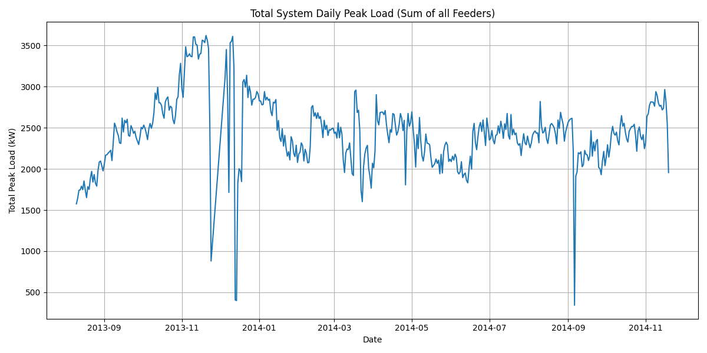
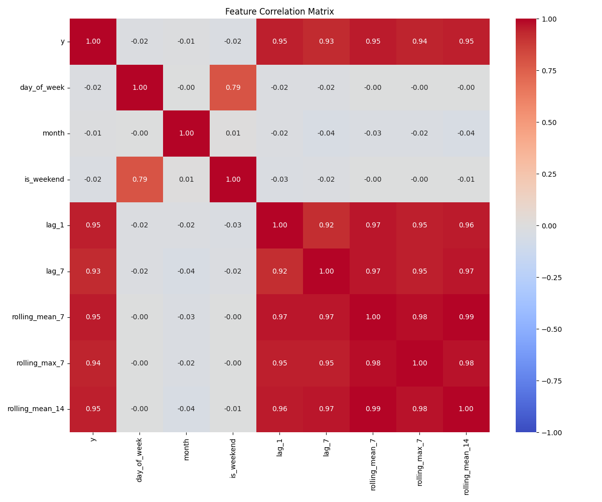
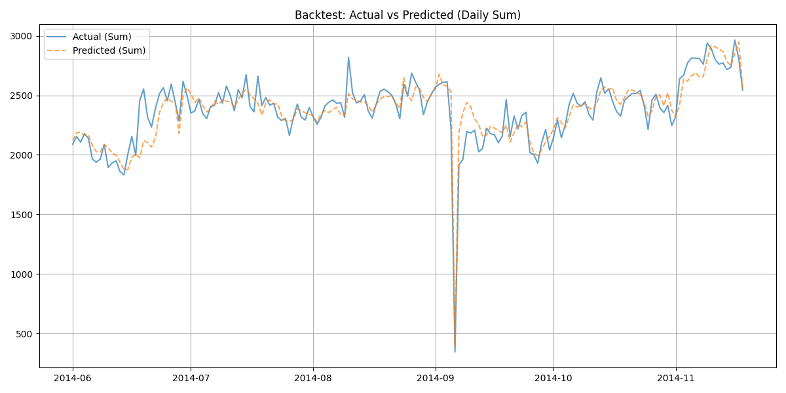
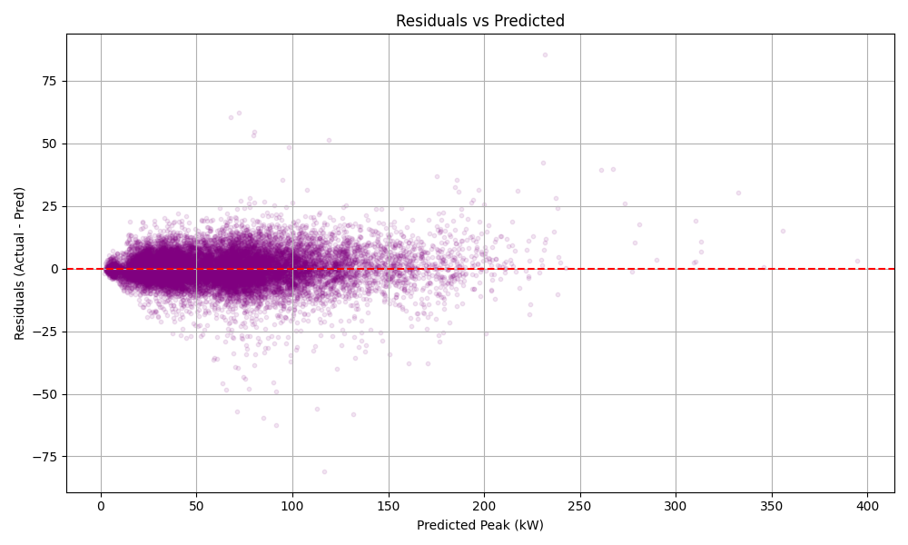

# SmartEnergyForecast

**SmartEnergyForecast** is a robust machine learning pipeline designed to forecast daily peak active power demand for electrical feeders. It leverages XGBoost, historical hourly data, and advanced feature engineering to predict tomorrow's maximum load.

## Project Highlights
- **Goal**: Predict Daily Peak Load (`P_total_max`) for 50+ feeders.
- **Model**: Global XGBoost Regressor (trained across all feeders).
- **Validation**: Walk-forward backtesting with strict leakage prevention.
- **Metrics**: MAE, RMSE, Peak MAE (top 10% loads).

---

## Quick Start


### 1. Build Dataset
Clean raw data, handle anomalies, and aggregate to daily peaks.
```powershell
python src/build_dataset.py
```

### 2. Exploratory Data Analysis (EDA)
Generate insights into load patterns and correlations.
```powershell
python src/eda.py
```
> **System Load**: Total daily peak across all feeders over time.
> 
>
> **Feature Correlations**: Relationship between lags, rolling stats, and target.
> 

### 3. Backtest (Verification)
Verify model performance on unseen past data using walk-forward validation (no leakage).
```powershell
python src/backtest.py
```
> **Performance**: Aggregated Actual vs Predicted during backtesting.
> 

### 4. Train Model
Train the final production model (supports optional hyperparameter tuning).
```powershell
# Standard Training
python src/train.py

# With Hyperparameter Tuning
python src/train.py --tune
```

### 5. Evaluate
Generate detailed regression diagnostics to trust the model.
```powershell
python src/evaluate.py
```
> **Accuracy**: observed vs predicted peaks.
> 
>
> **Residuals**: Checking for systematic errors.
> 

### 6. Forecast
Generate predictions for "Tomorrow" (or specific target date).
```powershell
python src/predict.py
```
*Outputs saved to `outputs/predictions.csv`*

---

## Repository Structure

```
SmartEnergyForecast/
├── data/                  # Raw and processed datasets
├── src/
│   ├── build_dataset.py   # Data cleaning & feature engineering
│   ├── eda.py             # Exploratory Data Analysis
│   ├── train.py           # XGBoost training pipeline
│   ├── backtest.py        # Walk-forward validation
│   ├── evaluate.py        # Detailed diagnostic plots
│   ├── predict.py         # Inference script
│   ├── features.py        # Feature logic (Lags, Rolling)
│   └── utils.py           # Shared utilities
├── models/                # Saved joblib models
├── outputs/               # Forecast CSVs
├── plots/                 # Generated visualizations
│   ├── eda/
│   ├── backtest/
│   └── evaluation/
├── configs/
│   └── backtest.yaml      # Configuration
└── requirements.txt
```

## Robustness Features
*   **Leakage Prevention**: Validated `shift(1)` logic and strict temporal split checks in backtesting.
*   **Anomaly Detection**: Automatically drops days where system-wide peak collapses (suspect data).
*   **Dtype Safety**: Enforced string types for Feeder IDs to prevent mixed-type errors.
---
[](https://doi.org/10.5281/zenodo.18075994)

